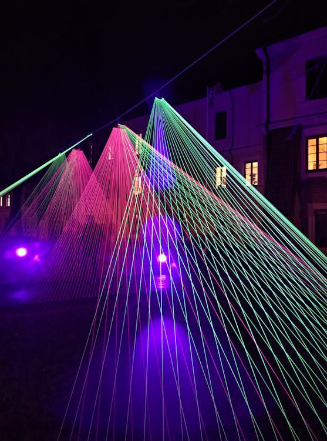

# LightDrive

LightDrive is a lighting control system for dmx lights. It is designed to be easy to use and to be able to control a
large number of lights.

!!! warning
    LightDrive is currently under heavy development.

# Features

!!! warning
    Not all features are implemented yet. Some listed features may not be available in the current version, but are planned for future releases.
    See the [README](https://github.com/Nmstr/LightDrive/blob/master/README.md) in the GitHub repository for the current state of the project.

    

        
    

    

        <ul style="margin-left: -100px">
            <li>Large selection of pre-defined fixtures</li>
            <li>Create your own fixtures</li>
        </ul>
    

    

        <ul style="margin-left: -100px">
            <li>Virtual lighting console</li>
            <li>Wide variety of available snippets</li>
            <li>Automatic sound triggers</li>
            <li>Fully timed light shows</li>
        </ul>
    

    

        
    

    

        
    

    

        <ul style="margin-left: -100px">
            <li>Support for ILDA Lasers</li>
            <li>ILDA support in normal shows</li>
        </ul>
    

    <ul style="margin-left: -100px">
        <li>Powerful Visualizer</li>
        <li>Fully Scriptable</li>
        <li>Open Source</li>
    </ul>

# Contributing

Contributions of all kinds are always welcome. Detailed information on how to contribute can be found [here](contributing) or in the GitHub repository.
